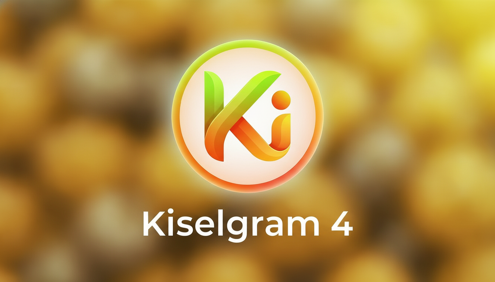

# Kiselgram

Open-source messaging platform — chat, call, share files, create groups and channels.

| Repo | What it does |
|------|-------------|
| [kiselgram](https://github.com/kiselgram/kiselgram) | Main server — Flask + PostgreSQL, WebRTC video calls via SocketIO |
| [kiselgram-desktop](https://github.com/kiselgram/kiselgram-desktop) | Desktop client (JavaFX) — macOS ARM64 `.app`, cross-platform JAR |
| [kiselgram-docs](https://github.com/kiselgram/kiselgram-docs) | User guide, API reference — [docs.kiselgram.ru](https://docs.kiselgram.ru) |
| [status](https://github.com/kiselgram/status) | Live service monitor — [status.kiselgram.ru](https://status.kiselgram.ru) |

Python · Flask · PostgreSQL · nginx · Docker · WebRTC · JavaFX · GitHub Pages
